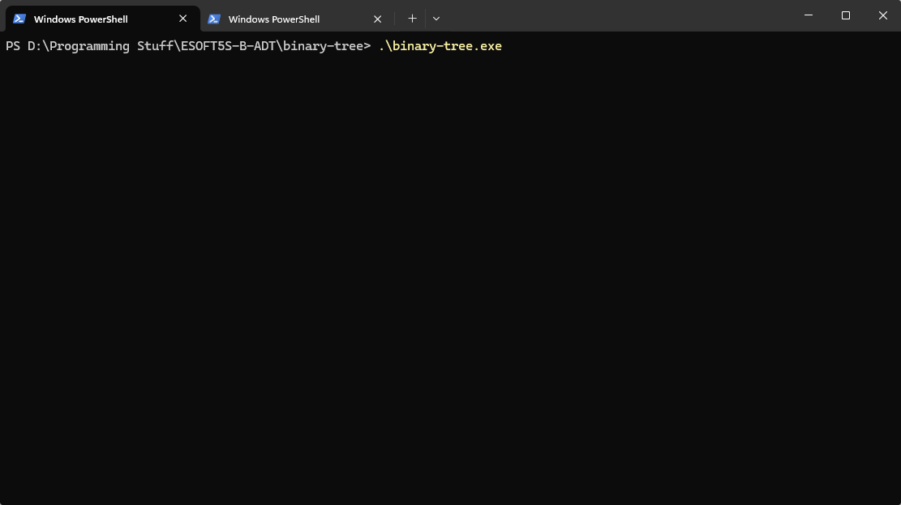

# Solicitação
2. Considere que você precisa armazenar os contatos de uma lista telefônica, onde cada contato é composto por um nome (string) e um número de telefone (string). O programa deve ser capaz de adicionar novos contatos, remover contatos existentes e buscar por um contato específico.

# Execução:
